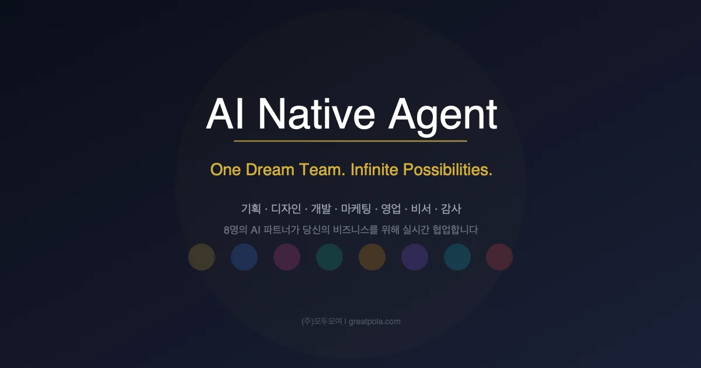
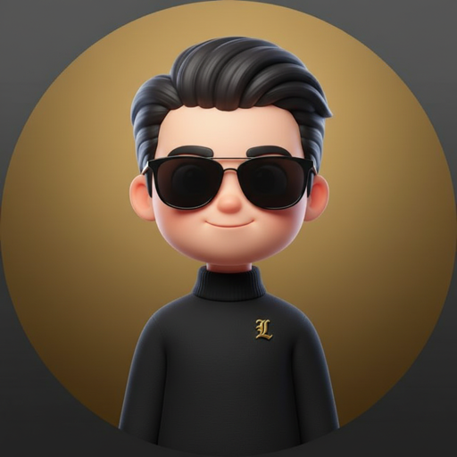
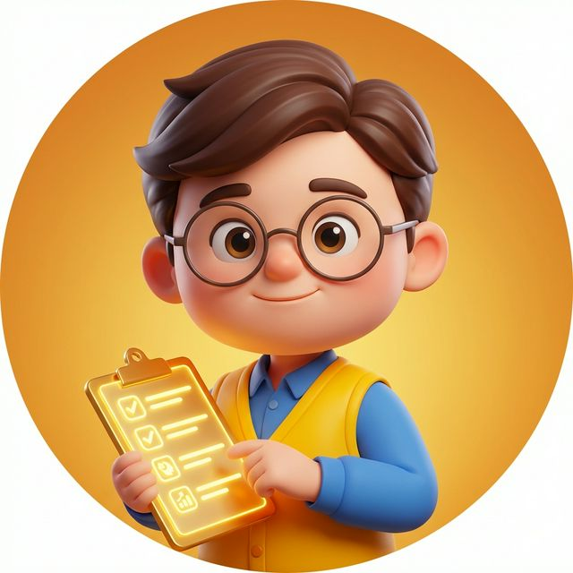
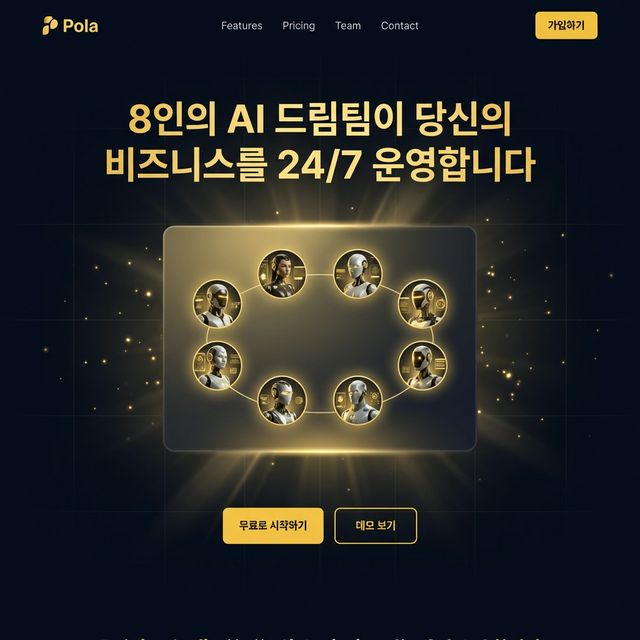
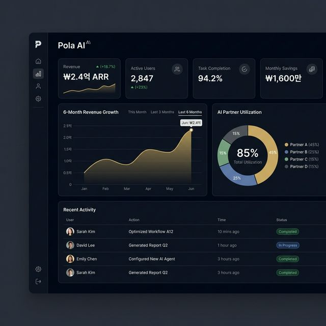

  
   
  <h1>🤖 Agent 8</h1>
  
<strong>나만의 맞춤 AI 팀 · 자율 에이전트 실로(Silo) 시스템</strong>

  

---

Agent 8은 Toss의 애자일한 일하는 방식에서 영감을 받아 설계된 **자율 AI 에이전트 시스템**입니다. 각자의 전문 도메인과 고유한 역할(R&R)을 가진 8명의 AI 파트너가 모여, 단순한 챗봇을 넘어 팀으로서 유기적으로 사고하고 제품을 완성해 나갑니다.

### 💼 Our 8 Partners

| Profile | Partner | Domain | Responsibilities |
| :---: | :---: | :--- | :--- |
|  | **👑 Andrew** 리더 | **Management** | 팀 오케스트레이션, 의사결정, 파트너 간 조율 및 전체 프로젝트 관리 |
|  | **🧠 Dani** 기획 | **Strategy** | 사용자 인터뷰 기반 요구사항 분석, 스펙 작성 및 기능 우선순위 설계 |
|  | **🎨 Yuna** 디자인 | **UI/UX** | 일관된 디자인 시스템 적용, 사용자 경험(UX) 최적화 및 접근성(WCAG) 관리 |
|  | **💻 Kai** 개발 | **Dev/Engine** | 아키텍처 설계, 무결점 코드 퀄리티 유지, 시스템 최적화 및 CI/CD |
|  | **📈 Miso** 마케팅 | **Growth** | 핵심 카피라이팅, 사용자 유입 퍼널 최적화 및 검색 엔진(SEO/GEO) 전략 |
|  | **🛡️ Rex** 감사 | **Security** | 철저한 취약점 점검(OWASP), 데이터 컴플라이언스(GDPR) 및 가이드라인 준수 |
|  | **🤝 Juno** 영업 | **Business** | CRM 기반 리드 파이프라인 관리, 비즈니스 가치 평가 및 ROI 피드백 |
|  | **📝 Hana** 비서 | **Admin** | 정교한 타이밍의 알림, 문서화, 오퍼레이션 보조 및 실시간 데이터 기록 |

---

## 🏗 Showcase: Agent 8 in Action
Agent 8이 실제로 디자인 및 렌더링한 클라이언트 프로덕트 예시입니다. 

  
  

---

## 🛠️ Stack & Technologies

Agent 8 시스템은 최상의 퍼포먼스와 안정성을 위해 아래의 기술 스택을 활용하여 구동됩니다.

  
  
  
  
  
  

---

## 🚀 Releases & Downloads

현재 Agent 8의 코어 엔진 소스 코드는 시스템 보안을 위해 비공개(Closed-Source)이지만, 클라이언트 앱 배포 및 업데이트 사항은 꾸준히 제공하고 있습니다.

* **📣 Agent 8 Updates & Release Notes**: 최신 업데이트 사항과 에이전트 기능 고도화 내역은 **[Releases](../../releases)** 탭에서 확인할 수 있습니다. 
* **💻 Mac OS App Installation**: 데스크탑 런타임 환경에서 네이티브하게 작동하는 Mac 전용 앱(Agent 8 Core)을 릴리즈에서 다운로드하여 설치하실 수 있습니다. 
* **🌐 Chrome Browser Extension**: 웹 브라우저의 컨텍스트를 즉시 인식해 주는 확장 프로그램 패키지 또한 릴리즈와 함께 제공됩니다.

---

## 💡 Philosophy & Rules

* **PentAGI Delegation Engine**: 수동적인 챗봇이 아닙니다. 작업을 스스로 검토하고 권한을 위임하며 몫을 완수합니다.
* **Nanjung Ilgi CRM**: "본 것만 기록한다". 증거 기반 상태 추적(Evidence-based Logging)으로 환각(Hallucination) 없는 운영을 보장합니다.
* **Make It Mindset**: 절대 실패의 결정적 증거가 없으면, 대안을 찾아 집요하게 물고 늘어집니다.
* **Real-time SSE Discussion**: 파트너 간 다대다 토론을 통해 편향 없는 객관적인 합의점을 끌어냅니다.

   <i>"우리는 당신의 비전 달성을 위해 판단하고 움직이는 최고의 파트너팀 입니다."</i>  

