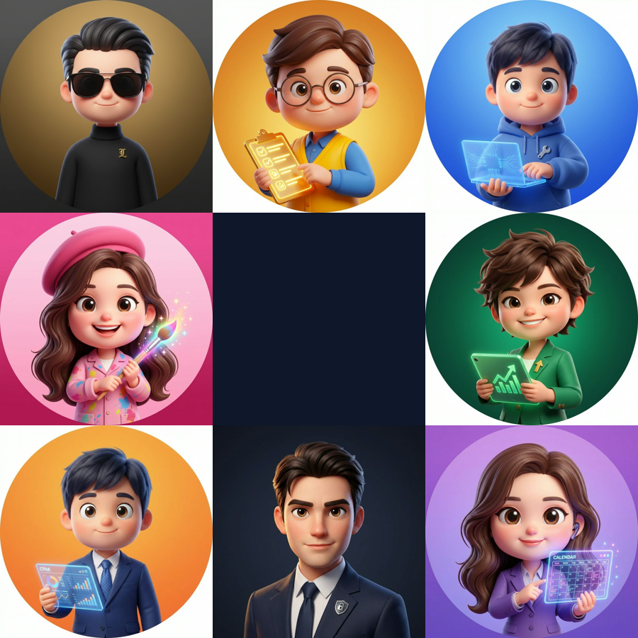

  

 

  <strong>Agent 8 — AI Workforce as a Service</strong>

---

### 월요일 아침, AI 팀 8명이 이미 출근해 있습니다.

프리랜서 구하고, 에이전시 미팅하고, 견적 비교하던 시간.
이제 그 시간에 **결과물을 받아보세요.**

Agent 8은 각자의 전문 도메인을 가진 8명의 AI 파트너가 팀으로서 유기적으로 사고하고, 제품을 완성해 나가는 자율 AI 에이전트 시스템입니다.

---

### 혼자 만드는 시대는 끝났습니다.

2020년대, 스타트업의 병목은 명확했습니다. 개발자를 구하고, 디자이너를 설득하고, 마케터와 일정을 맞추는 데 한 달이 걸렸습니다. 아이디어는 있는데 만들 사람이 없고, 만들 수 있는 사람은 이미 다른 프로젝트에 묶여 있었습니다.

그래서 외주를 맡기고, 에이전시에 의뢰하고, SaaS 도구를 구독했습니다. 하지만 돌이켜보면, 그것은 **더 비싼 혼자**였을 뿐입니다.

---

### Partners

| Name | Role | Domain | What they do |
| :--- | :---: | :--- | :--- |
| **Andrew** (앤드류) | 리더 | Management | 팀 오케스트레이션, 의사결정, 파트너 간 조율 및 프로젝트 총괄 |
| **Dani** (다니) | 기획 | Strategy | 사용자 요구사항 분석, 스펙 작성, 기능 우선순위 설계 |
| **Yuna** (유나) | 디자인 | UI/UX | 디자인 시스템 관리, 사용자 경험 최적화, 접근성 검수 |
| **Kai** (카이) | 개발 | Dev/Engine | 아키텍처 설계, 코드 품질 유지, 성능 최적화, CI/CD |
| **Miso** (미소) | 마케팅 | Growth | 카피라이팅, 사용자 유입 퍼널 최적화, SEO/GEO 전략 |
| **Rex** (렉스) | 감사 | Security | 취약점 점검(OWASP), 컴플라이언스(GDPR), 보안 가이드라인 |
| **Juno** (주노) | 영업 | Business | CRM 파이프라인 관리, 리드 발굴, ROI 중심 피드백 |
| **Hana** (하나) | 비서 | Admin | 알림 관리, 문서화, 오퍼레이션 보조, 실시간 데이터 기록 |

---

### 개발은 빙산의 일각입니다.

비즈니스에서 필요한 건 '코드'가 아닙니다. 기획, 디자인, 마케팅, 영업, 보안 — 이 모든 것이 연결되지 않은 채 각자의 사일로에서 조용히 낭비되고 있었습니다.

**하나로 연결하면 어떻게 될까요?**

---

### 맥락이 실행이 되는 AI 팀 플랫폼

발견에서 실행까지, 30일이 아니라 3일로.

**1. CONTEXT** — 프로젝트 목표, 브랜드 가이드, 기존 코드베이스, 시장 데이터, 고객 피드백

**2. INTELLIGENCE** — 8파트너 합의, 교차 검증, 자율 학습, 패턴 인식, 우선순위 판단

**3. EXECUTION** — 기획서 작성, UI/UX 설계, 코드 생성, 마케팅 전략, 보안 감사, 세일즈 피치

---

### 월요일 아침이 바뀝니다.

실제 스타트업이 겪는 문제. Agent 8이 해결하는 방법.

| Before | After — Agent 8 |
| :--- | :--- |
| "프리랜서 찾다가 한 달 지났어요" | Google 로그인 30초면 8명이 출근합니다 |
| "디자인 수정할 사람이 없어요" | 전담 디자이너 유나가 즉시 수정합니다 |
| "아이디어는 있는데 만들 사람이 없어요" | 기획서부터 배포까지, Agent 8이 실행합니다 |

---

### Stack

Next.js · React · TypeScript · Tailwind CSS · Firebase · Vertex AI

---

### Releases & Downloads

Agent 8의 코어 엔진 소스 코드는 비공개이지만, 클라이언트 앱과 업데이트는 이 저장소의 Releases 탭을 통해 배포합니다.

- **Release Notes** — 시스템 업데이트 및 에이전트 기능 고도화 내역
- **Mac App** — 데스크탑 환경에서 네이티브로 동작하는 Mac 전용 앱
- **Chrome Extension** — 웹 브라우저 컨텍스트를 실시간 인식하는 확장 프로그램

---

  <i>"우리는 당신의 비전 달성을 위해 판단하고 움직이는 최고의 파트너팀입니다."</i>

