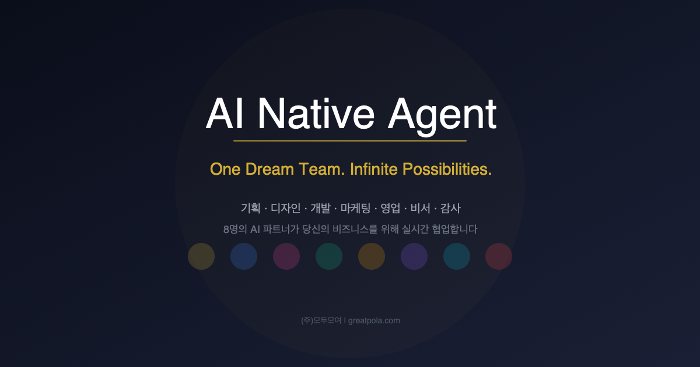
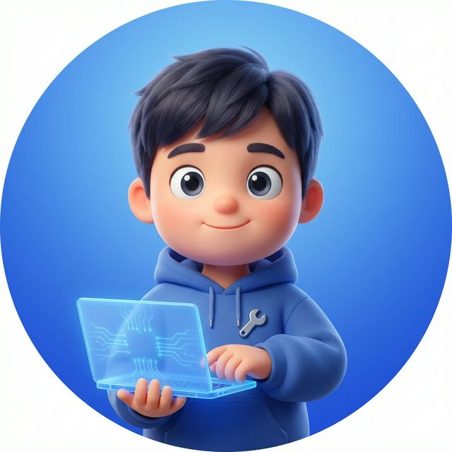
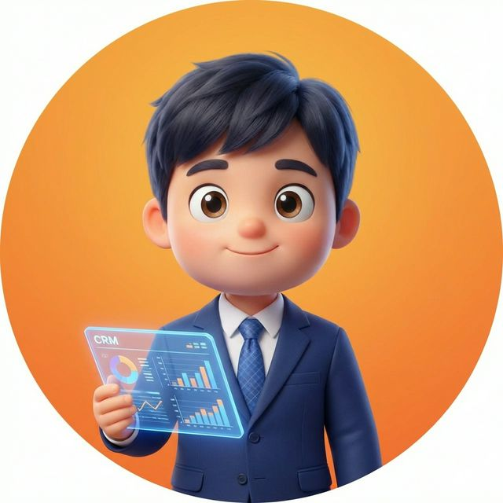
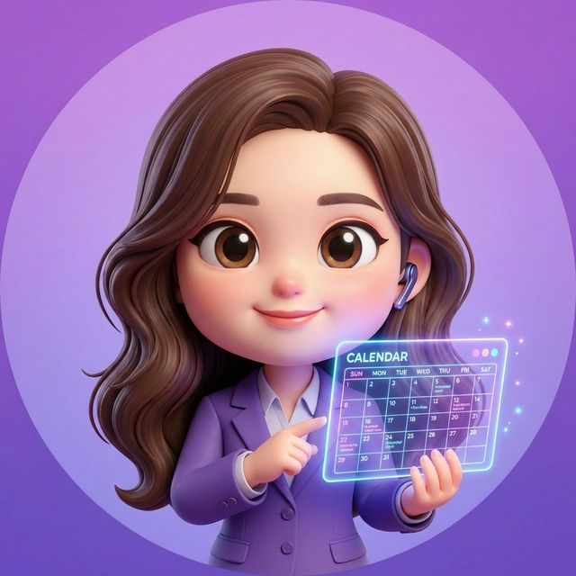

  

 

  

---

## About

Agent 8은 각자의 전문 도메인과 고유한 역할을 가진 8명의 AI 파트너가 팀으로서 유기적으로 사고하고, 제품을 완성해 나가는 자율 AI 에이전트 시스템입니다. 단순한 챗봇이 아닌 실제 조직처럼 논의하고 합의하며 결과물을 만들어냅니다.

## Partners

| | Name | Role | Domain | What they do |
| :---: | :---: | :---: | :--- | :--- |
|  | **Andrew** | 리더 | Management | 팀 오케스트레이션, 의사결정, 파트너 간 조율 및 프로젝트 총괄 |
|  | **Dani** | 기획 | Strategy | 사용자 요구사항 분석, 스펙 작성, 기능 우선순위 설계 |
|  | **Yuna** | 디자인 | UI/UX | 디자인 시스템 관리, 사용자 경험 최적화, 접근성 검수 |
|  | **Kai** | 개발 | Dev/Engine | 아키텍처 설계, 코드 품질 유지, 성능 최적화, CI/CD |
|  | **Miso** | 마케팅 | Growth | 카피라이팅, 사용자 유입 퍼널 최적화, SEO/GEO 전략 |
|  | **Rex** | 감사 | Security | 취약점 점검(OWASP), 컴플라이언스(GDPR), 보안 가이드라인 |
|  | **Juno** | 영업 | Business | CRM 파이프라인 관리, 리드 발굴, ROI 중심 피드백 |
|  | **Hana** | 비서 | Admin | 알림 관리, 문서화, 오퍼레이션 보조, 실시간 데이터 기록 |

---

## Stack

  
  
  
  
  
  

---

## Releases & Downloads

Agent 8의 코어 엔진 소스 코드는 비공개이지만, 클라이언트 앱과 업데이트는 이 저장소의 [Releases](../../releases) 탭을 통해 배포하고 있습니다.

- **Release Notes** — 시스템 업데이트 및 에이전트 기능 고도화 내역
- **Mac App** — 데스크탑 환경에서 네이티브하게 동작하는 Mac 전용 앱
- **Chrome Extension** — 웹 브라우저 컨텍스트를 실시간 인식하는 확장 프로그램

---

## How it works

Agent 8의 파트너들은 각자 독립적인 전문성을 갖고 있으면서도, 하나의 태스크가 들어오면 관련 파트너들이 자율적으로 소집되어 다대다 토론을 진행합니다. 편향 없는 합의를 거쳐 최종 결과물을 도출하며, 모든 판단과 행동에는 실제 증거가 기록됩니다.

- **자율 위임**: 작업을 스스로 검토하고 적합한 파트너에게 위임하며 완수합니다.
- **증거 기반 기록**: 눈으로 보고 검증한 것만 기록합니다. 환각 없는 운영을 보장합니다.
- **실시간 합의**: 파트너 간 실시간 토론을 통해 객관적인 결론을 도출합니다.

---

  <i>"우리는 당신의 비전 달성을 위해 판단하고 움직이는 최고의 파트너팀입니다."</i>

